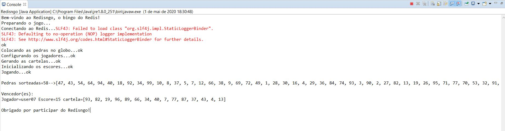

# Redisngo

## Implemantação em Java usando a biblioteca Redisson.
## Projeto elaborado no Eclipse, usando Maven.

A implementação seguiu a especificação dos requisitos passadas no enunciado do trabalho, mas com alguns detalhes:

1. O jogo permite mais de um vencedor, desde que eles atinjam o escore pré-determinado (15) na mesma jogada.
1. A geração das cartelas deu-se à partir de subconjuntos aleatórios das "pedras" do jogo.
   1. o método *random(int n)* da classe *org.redisson.api.RSet* permite extrair um subconjunto aleatório de itens de um conjunto, com *n* itens.  
1. As pedras sorteadas no jogo, bem como a lista dos vencedores, também são armazenadas em estruturas do Redis e posteriormente exibidas como informações sobre a apuração dos vencedores.

Constam no repositório:

1. um arquivo JAR gerado a partir da exportação do projeto do Eclipse.
2. a estrutura do projeto "as is", como mantido pelo Eclipse (pasta RedisDemo).

Uma vez conseguindo importar o projeto no Eclipse, basta executar diretamente a classe Redisngo.

Captura da tela de execução

